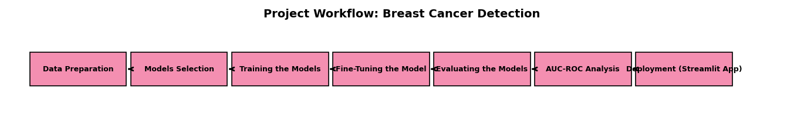

# 🧬 Breast Cancer Diagnosis Predictor  

<p align="center">  
    
</p>  

An interactive web application built with **Python**, **Streamlit**, and **Machine Learning** to predict whether a breast tumor is **benign (non-cancerous)** or **malignant (cancerous)**.  

The model is trained on the well-known [Wisconsin Breast Cancer Dataset](https://www.kaggle.com/datasets/uciml/breast-cancer-wisconsin-data), with **97% accuracy**, and provides **visual explanations** to support awareness and early detection.  

🚫 **Disclaimer:** This tool is for **educational purposes only** and not a substitute for medical advice.  

---

##  Project Workflow  

<p align="center">  
    
</p>  

**Steps:**  
`Data Preparation → Models Selection → Training the Models → Fine-Tuning → Evaluation → AUC-ROC Analysis → Deployment (Streamlit App)`  

---

##  How It Works  

1. **Input Tumor Measurements**  
   - Enter 10 most important diagnostic features (or use sample input).  

2. **Prediction Output**  
   - 🟢 **Benign** or 🔴 **Malignant**  
   - ✅ Confidence Score (e.g., 96%)  

3. **Visual Feedback**  
   - Bar chart showing entered feature values.  

4. **Insights & Recommendations**  
   - Highlights the strongest influencing features.  

---

##  Model Training  

 Implemented in [`train_model.py`](train_model.py)  

- Compared multiple models: Logistic Regression, Decision Tree, Random Forest, SVM, KNN, Gradient Boosting.  
- **Best Model:** Random Forest Classifier  
- **Metrics Achieved:**  
  - Accuracy: **97%**  
  - Precision: **0.95**  
  - Recall: **0.93**  
  - F1-Score: **0.96**  
  - AUC-ROC: **0.99**  

**Top Features (Random Forest):**  
`concave points_worst`, `concave points_mean`, `radius_worst`, `area_worst`, `perimeter_worst`, `compactness_mean`, `texture_worst`, `smoothness_worst`, `concavity_worst`, `symmetry_worst`.  

---
 **Features:**  
-  User-friendly tumor feature input  
-  Real-time prediction (Benign/Malignant)  
-  Confidence score display  
-  Visualization of input features  
-  Sidebar with FAQ and disclaimer  

👉 **Live Demo:** [Click here to try the app](https://breast-cancer-detection-app-id.streamlit.app/)  

---

##  Project Structure  

```bash
breast-cancer-predictor/
│── app.py                     
│── train_model.py             
│── breast_cancer.csv          
│── workflow.png               
│── assets/
│   └── breast_cancer_awareness.png
│── models/
│   ├── best_rf_model.pkl      
│   └── top_features.pkl       
│── requirements.txt           
│── README.md                  

#  Run Locally

 1. Clone repository
git clone https://github.com/Amarachi-flora/breast-cancer-detection-app.git
cd breast-cancer-predictor

 2. Install dependencies
pip install -r requirements.txt

 3. Train model (optional)
python train_model.py

 4. Launch app
streamlit run app.py

 Technical Report

 See full details in Technical_Report.pdf

 1. Problem statement & objectives

 2. Model training & evaluation results

 3. Visualizations (heatmaps, confusion matrix, feature importances etc.)

 4. Insights, recommendations, limitations, future work and conclusions.


 Technologies Used

 1. Python (Pandas, NumPy, Seaborn, Matplotlib)

 2. Scikit-learn (ML Models + GridSearchCV)

 3. Streamlit (Web Deployment)

 4. Plotly (Interactive Visuals)

 Contribution

⭐ Star this repo to show support
🍴 Fork it and try improvements
🛠️ Submit issues or pull requests


  License

This project is licensed under the MIT License.
© 2025 Amarachi Florence Onyedinma-Nwamaghiro, free to use with attribution.